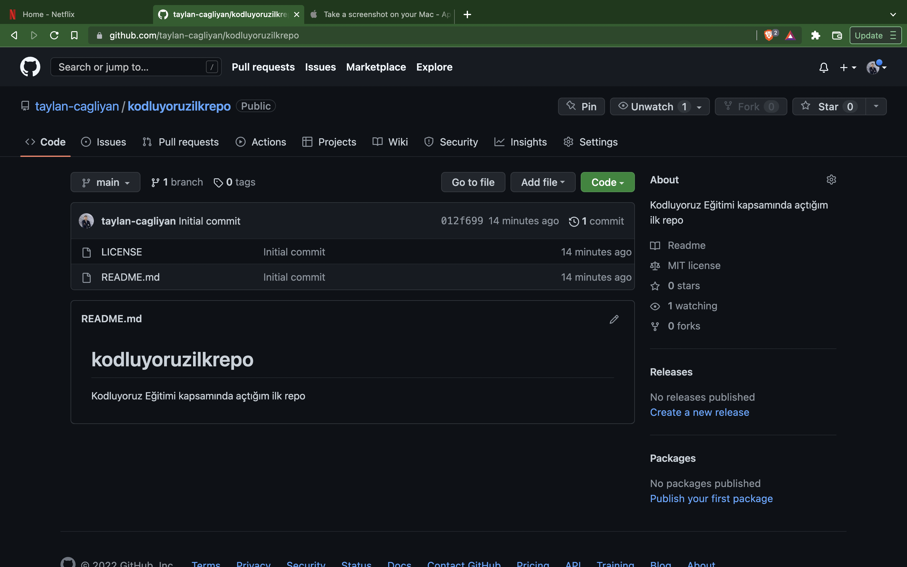

# Kodluyoruz Ilk Repo

Bu repo [kodluyoruz](https://www.kodluyoruz.org/) Front-End Eğitiminde oluşturduğumuz ilk repo. İçerisinde bir adet README dosyası, bir adet de index.html barındıyor.



## Installation

Öncelikle projeyi clonelayın. (https://github.com/taylan-cagliyan/kodluyoruzilkrepo.git)

```bash
git clone https://github.com/taylan-cagliyan/kodluyoruzilkrepo.git
```
## Usage

Projeyi cloneladıktan sonra Visual Studio Code programında açınız.

Linux için:

```bash
cd kodluyoruzilkrepo
code .
```

## Contributing
Pull requestler kabul edilir. Büyük değişiklikler için, lütfen önce neyi değiştirmek istediğinizi tartışmak için bir konu açınız.


## License
[MIT](https://choosealicense.com/licenses/mit/)